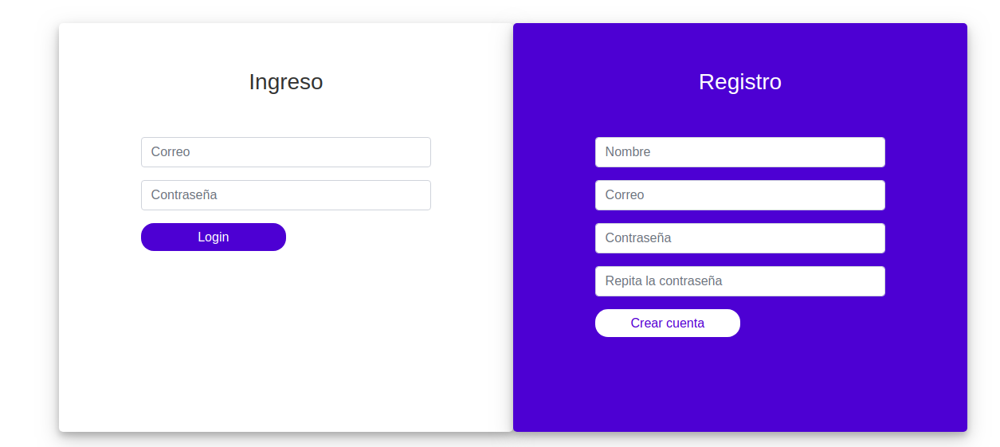
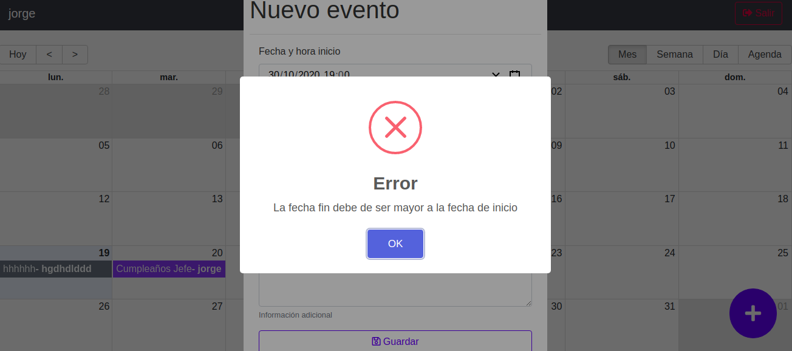
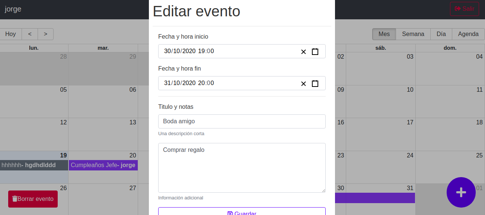

Calendar App es una aplicación que lo ayudará a planificar eventos comunes en el tiempo para un grupo de personas, construida con React, JavaScript y CSS.Es una App con Full Stack JavaScript ya que se usa JavaScript tanto en el lado del cliente como en el servidor desarrollada mediate mongoDB, Express, React and Node.js (MERN).Mongo  se usó como base de datos no relacional apoyándonos en mongoose para modelar los datos con Express se  creó una infraestructura sólida para la web y se  manejó todo el Backend con Node.
Usa React Router para crear rutas privadas y públicas además del uso Hooks y Hooks personalizados y  Redux para manejar el estado de la app.La autenticación con redux la realizamos utilizando JSON Web Tokens (JWT) y su re-validación.Los estilos son trabajados Bootstrap y muestra de informaciones con "sweetalert2".Tambien se realizarón Unit and integration tests mediante Jest donde se ocupó Enzyme, React Testing Library y Mocks.La app fue alojada mediante Heroku y se protegen las contraseñas mediante la Encriptación de las mismas. 

Capturas de pantalla del proyecto

Link para acceder a la app

https://mern-calenda.herokuapp.com/

Instrucciones de instalación y configuración

Clona este repositorio. Necesitará node y npm instalada a nivel global en su máquina.

Instalación:

npm install

Para iniciar el servidor:

npm start

Para visitar la aplicación:

localhost:3000/
